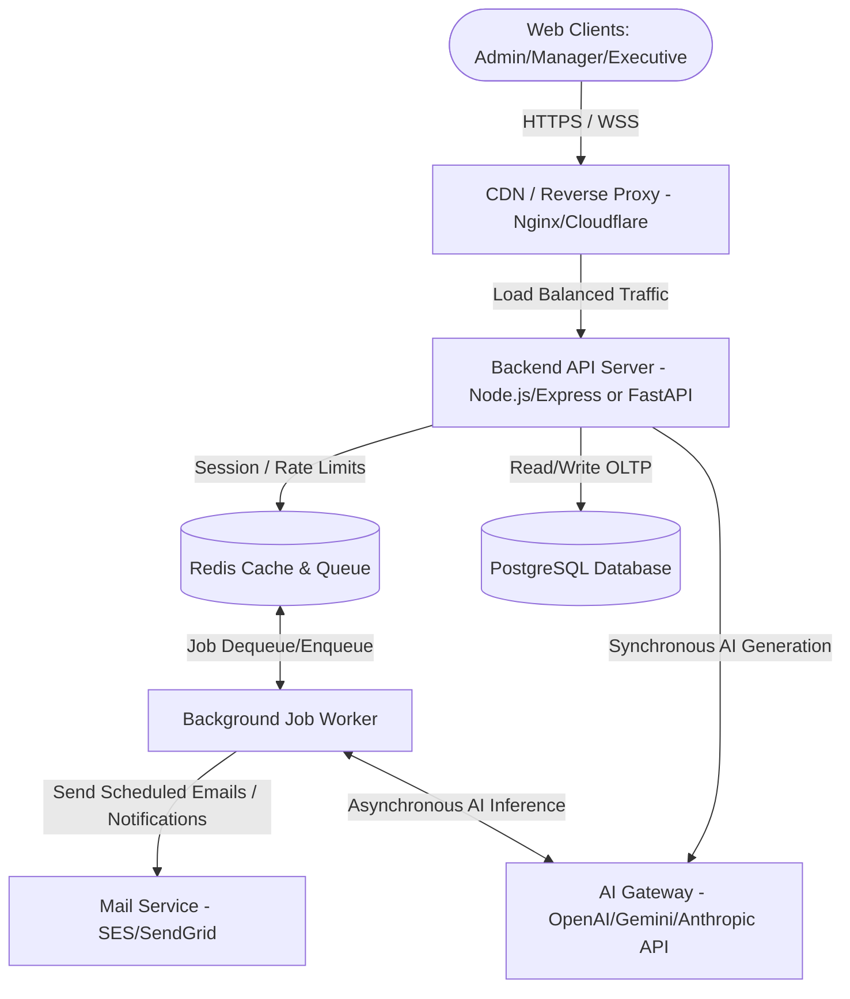
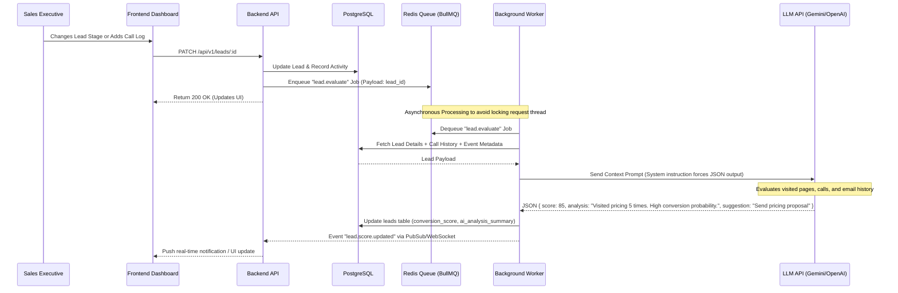
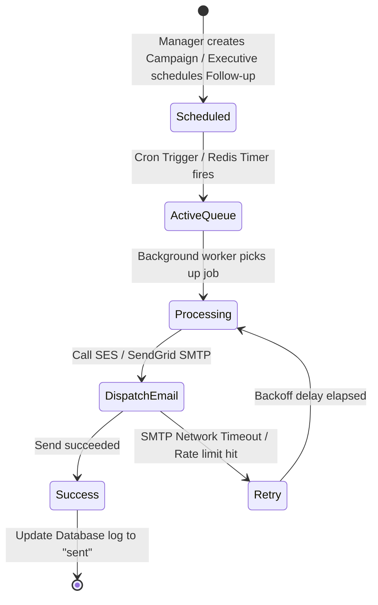

# System Architecture: AI-Powered CRM & Sales Management Platform

This document outlines the system architecture for the enterprise **AI-Powered CRM & Sales Management Platform**. The architecture is optimized for performance, scalability, secure Role-Based Access Control (RBAC), and low-latency AI integrations, keeping the footprint lean by avoiding unnecessary features.

---

## 1. System Overview & Technology Stack

The platform is designed around a three-tier architecture with a decoupled frontend, backend API, and specialized AI/Job processing layers.



### Technology Stack Decisions
* **Frontend**: **React.js** (Vite or Next.js SPA) + **Tailwind CSS**. Provides a modern, responsive interface with fast rendering speeds.
* **Backend API**: **Node.js** (TypeScript + Express) or **Python** (FastAPI). FastAPI is chosen for the AI/Scoring components due to native asynchronous execution and clean typing, or TypeScript/Express for rapid JSON REST API composition. *Recommendation*: Node.js with TypeScript for the main API and a helper Python microservice for AI scoring, or a unified TypeScript server with direct LLM client SDK integration.
* **Database**: **PostgreSQL** (Relational OLTP). Vital for strict relations between Leads, Pipeline Stages, Call Records, and Teams.
* **Cache & Message Broker**: **Redis**. Powers BullMQ/Celery for scheduled email campaigns, notifications, and background AI tasks.
* **AI Engine**: **OpenAI / Gemini SDK**. Leveraged for generative email composition, semantic activity analysis, and computing lead conversion scores.

---

## 2. Database Schema Design (PostgreSQL)

To support transactional integrity, team ownership, and pipeline histories, a relational database is structured as follows.

```mermaid
erDiagram
    USERS ||--o{ LEADS : "manages/owns"
    TEAMS ||--o{ USERS : "contains"
    LEADS ||--o{ PIPELINE_HISTORY : "tracks"
    LEADS ||--o{ FOLLOW_UPS : "schedules"
    LEADS ||--o{ CALL_RECORDS : "records"
    LEADS ||--o{ EMAIL_LOGS : "sends"
    EMAIL_TEMPLATES ||--o{ EMAIL_LOGS : "instantiates"
    
    USERS {
        uuid id PK
        string name
        string email UNIQUE
        string password_hash
        string role "admin | manager | executive"
        uuid team_id FK
        timestamp created_at
    }
    
    TEAMS {
        uuid id PK
        string name
        timestamp created_at
    }

    LEADS {
        uuid id PK
        string name
        string company
        string phone
        string email
        string source "pricing_page | demo_request | cold_outreach | ad_campaign"
        string stage "new_lead | qualified | proposal | negotiation | won | lost"
        integer conversion_score "0-100"
        text ai_analysis_summary
        uuid assigned_to FK "User ID"
        timestamp last_activity_at
        timestamp created_at
        timestamp updated_at
    }

    PIPELINE_HISTORY {
        uuid id PK
        uuid lead_id FK
        string from_stage
        string to_stage
        uuid changed_by FK "User ID"
        timestamp changed_at
    }

    FOLLOW_UPS {
        uuid id PK
        uuid lead_id FK
        uuid assigned_to FK "User ID"
        string title
        text description
        timestamp scheduled_time
        string status "pending | completed | missed"
        boolean email_reminder_sent
        timestamp created_at
    }

    CALL_RECORDS {
        uuid id PK
        uuid lead_id FK
        uuid executive_id FK "User ID"
        text summary
        integer duration_seconds
        timestamp call_time
    }

    EMAIL_TEMPLATES {
        uuid id PK
        string name
        string subject
        text body_html
        string type "follow_up | proposal | reminder"
        timestamp created_at
    }

    EMAIL_LOGS {
        uuid id PK
        uuid lead_id FK
        uuid template_id FK
        string subject
        text body_html
        string status "scheduled | sent | failed"
        timestamp scheduled_time
        timestamp sent_at
    }
```

### Key Performance Indexes
1. `CREATE INDEX idx_leads_assigned_to ON leads(assigned_to);` — Speeds up lead queries for sales executives and managers.
2. `CREATE INDEX idx_leads_stage ON leads(stage);` — Speeds up pipeline dashboard aggregations.
3. `CREATE INDEX idx_follow_ups_scheduled_time_status ON follow_ups(scheduled_time, status) WHERE status = 'pending';` — Optimizes background cron worker picking up imminent follow-ups.
4. `CREATE INDEX idx_email_logs_status_scheduled ON email_logs(status, scheduled_time) WHERE status = 'scheduled';` — Speeds up email scheduler queries.

---

## 3. Role-Based Access Control (RBAC) Matrix

To prevent data leaks and maintain proper authorization boundaries, API-level access is partitioned based on the three designated roles:

| Module / Operation | Admin | Sales Manager | Sales Executive |
| :--- | :---: | :---: | :---: |
| **Manage Teams (Create/Delete/Modify)** | ✅ Yes | ❌ No | ❌ No |
| **Manage Pipelines (Add/Delete Stages)** | ✅ Yes | ❌ No | ❌ No |
| **Global Analytics & System Auditing** | ✅ Yes | ❌ No | ❌ No |
| **Assign Leads (Self & Between Executives)** | ✅ Yes | ✅ Yes (Within Team) | ❌ No (Read-only owned) |
| **Monitor Team Performance (Metrics/Logs)** | ✅ Yes | ✅ Yes (Within Team) | ❌ No |
| **Create/Read/Update Leads** | ✅ Yes | ✅ Yes | ✅ Yes (Only Owned Leads) |
| **Schedule & Mark Follow-Ups** | ✅ Yes | ✅ Yes | ✅ Yes (Only Owned Leads) |
| **Record Call Summaries** | ✅ Yes | ✅ Yes | ✅ Yes (Only Owned Leads) |
| **Launch/Schedule Email Campaigns** | ✅ Yes | ✅ Yes | ❌ No |

---

## 4. API Endpoints Design (REST API)

### 4.1 Authentication & User Management
* `POST /api/v1/auth/login` - Authenticate user, return JWT and role permissions.
* `POST /api/v1/admin/teams` - Create a sales team (Admin only).
* `GET /api/v1/admin/teams/:id/members` - List members of a team.

### 4.2 Lead Management
* `GET /api/v1/leads` - List leads. Filterable by `stage`, `assigned_to`, and `source`. (Execs see only their assigned leads; Managers/Admins see all or team-specific leads).
* `POST /api/v1/leads` - Create a new lead.
* `GET /api/v1/leads/:id` - Fetch single lead, including activity log, AI analysis summary, and score.
* `PATCH /api/v1/leads/:id` - Update lead fields (e.g. stage, contact details). Triggers an asynchronous Lead Scoring & AI Analysis event.
* `PATCH /api/v1/leads/:id/assign` - Assign a lead to a Sales Executive (Manager and Admin only).

### 4.3 Follow-up & Call Records
* `GET /api/v1/follow-ups` - Get list of follow-ups for calendar view (filtered by `assigned_to` and `scheduled_time` range).
* `POST /api/v1/follow-ups` - Schedule a follow-up.
* `PATCH /api/v1/follow-ups/:id` - Update status (e.g., mark as `completed`).
* `POST /api/v1/leads/:id/calls` - Record a phone call description and duration.

### 4.4 Email Campaigns
* `GET /api/v1/email-templates` - Get list of message templates.
* `POST /api/v1/email-campaigns/schedule` - Schedule a template to be sent to a filtered group of leads at a specified time (Manager and Admin only).

### 4.5 AI Integration
* `POST /api/v1/ai/leads/:id/analyze` - Manually trigger AI lead analysis (inputs custom tracking events).
* `POST /api/v1/ai/generate-email` - Generate dynamic email body. Takes context inputs: `lead_id`, `template_type` (follow-up, proposal, or reminder), and optional customization prompts.

---

## 5. AI Sales Assistant & Lead Scoring Agent Workflow

The AI engine uses LLMs (such as Claude/Gemini/GPT) via JSON schemas to process and return structured recommendations.



### AI Schema Validation Examples

#### 1. Lead Scoring and Analysis
* **Prompt System Instructions**:
  > "You are an expert CRM lead analysis model. Analyze the following lead profile containing history, activity counts, and interaction logs. Output *only* a valid JSON object matching the schema."
* **System Output JSON Schema**:
  ```json
  {
    "conversion_score": 85,
    "probability_class": "high",
    "analysis_summary": "Prospect visited the pricing page 5 times and has had 2 positive phone interactions. Likely ready to proceed with a trial/proposal.",
    "next_best_action": "Email a custom proposal template based on their interest in enterprise features."
  }
  ```

#### 2. Email Generator
* **Prompt System Instructions**:
  > "Generate a professional sales outreach email based on the recipient name, company name, context (e.g. follow-up after pricing page view, proposal delivery, or meeting reminder), and matching tone."
* **System Output JSON Schema**:
  ```json
  {
    "subject": "Tailored Solutions for [Company Name] - Let's connect",
    "body_html": "<p>Hi [Name],</p><p>I noticed you recently spent some time looking at our pricing pages. I would love to answer any questions you have regarding our volume discounts...</p>"
  }
  ```

---

## 6. Workflow Automation & Job Scheduling

Campaigns, email schedules, and notifications are processed asynchronously using a queue. This guarantees that emails are dispatched accurately and system memory usage remains flat.



### Event & Job Workflows
1. **Reminder Notification Daemon**: Runs every minute (cron). Finds all `FOLLOW_UPS` scheduled for `now() + 15 minutes` where `status = 'pending'` and `email_reminder_sent = false`.
   * Enqueues `send.reminder.email` job for the assigned user/lead.
   * Updates `email_reminder_sent = true` to avoid duplicate dispatch.
2. **Email Campaign Dispatcher**: Scheduled campaign queue. Splits a campaign targeting 500 leads into individual batches of 20 emails per minute to comply with SMTP rate limits.
   * Leverages Redis-backed queue to track state and handle retries with exponential backoff.

---

## 7. Performance, Analytics & Dashboard Strategy

To ensure pages load instantly and dashboards remain interactive (even with large volumes of leads and pipeline histories), the platform adopts the following strategies:

* **Aggregated Counters / Views**:
  * Instead of calculating pipeline statistics dynamically (e.g., executing `COUNT` on hundreds of thousands of leads on every dashboard load), the system maintains a materialized view or updates an aggregated table containing counts grouped by `team_id` and `stage`.
  * The view updates periodically (every 10 minutes) or is recalculated incrementally via database triggers.
* **Paginated API Feeds**:
  * All list views (`GET /api/v1/leads`) enforce offset/cursor pagination limits (defaulting to 25 records).
* **AI Caching**:
  * AI analysis is triggered only when actionable fields (e.g., stage, major activity logs, page views) change. It is never recalculated dynamically on read requests.
