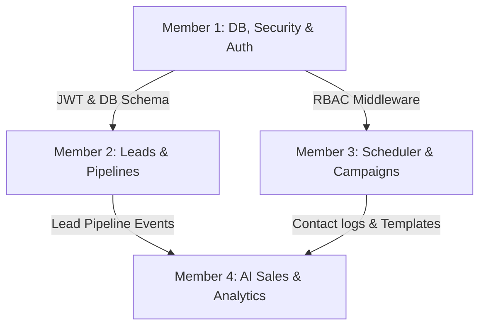

# Team Task Distribution & Implementation Prompts

This document outlines the operational division of labor for a **4-member development team** to build the AI-Powered CRM & Sales Management Platform. It breaks down the system modules, establishes clear team roles, and provides structured prompts for each development task.

---

## 1. Summary of Team Roles



| Member | Primary Focus | Modules Covered | Key Deliverables |
| :--- | :--- | :--- | :--- |
| **Member 1** | Backend Core & Auth | Database, User Management, Auth (JWT, RBAC) | Database DDL schema, Auth APIs, RBAC middleware, User management routes. |
| **Member 2** | Customer Engine & UI | Lead Management, Pipeline APIs, Kanban Dashboard | Lead CRUD APIs, lead assignment algorithms, Frontend Kanban Board interface. |
| **Member 3** | Campaigns & Automation | Follow-Ups, Calendar, Call Logs, Scheduled Email Worker | Task Calendar (front & backend), Call log API, Redis job processor, Email batch sender. |
| **Member 4** | AI Services & Analytics | AI Assistant (Scoring/Generator), Metrics Dashboard | LLM connector service, background scoring worker, email content generator, admin analytical views. |

---

## 2. Detailed Task Distribution & Development Prompts

---

### MEMBER 1: Core Database, Authentication & Security (Backend)

#### Assigned Modules:
* **Database Layer**: PostgreSQL setup, table indexes, structural foreign keys, transaction constraints.
* **Authentication Service**: Token generation (JWT), user registration, encrypted credential validation.
* **Role-Based Access Control (RBAC)**: Security middleware validation restricting endpoint access by Admin, Manager, and Executive roles.

---

#### Structured Prompt 1.1: Database DDL Schema Setup & Migration Scripts
```text
Role: Principal Database Architect
Task: Create a SQL schema file `schema.sql` for PostgreSQL containing tables for a CRM platform. 

Strict Requirements:
1. Define the following tables with primary keys, explicit types, and timestamps:
   - users (id UUID, name, email UNIQUE, password_hash, role ENUM['admin', 'manager', 'executive'], team_id UUID, created_at, updated_at)
   - teams (id UUID, name, created_at)
   - leads (id UUID, name, company, phone, email, source VARCHAR, stage ENUM['new_lead', 'qualified', 'proposal', 'negotiation', 'won', 'lost'], conversion_score INT, ai_analysis_summary TEXT, assigned_to UUID FK users.id, last_activity_at, created_at, updated_at)
   - pipeline_history (id UUID, lead_id UUID FK leads.id, from_stage, to_stage, changed_by UUID FK users.id, changed_at)
   - follow_ups (id UUID, lead_id UUID FK leads.id, assigned_to UUID FK users.id, title, description, scheduled_time, status ENUM['pending', 'completed', 'missed'], email_reminder_sent BOOLEAN, created_at)
   - call_records (id UUID, lead_id UUID FK leads.id, executive_id UUID FK users.id, summary TEXT, duration_seconds INT, call_time)
   - email_templates (id UUID, name, subject, body_html, type ENUM['follow_up', 'proposal', 'reminder'], created_at)
   - email_logs (id UUID, lead_id UUID FK leads.id, template_id UUID FK email_templates.id, subject, body_html, status ENUM['scheduled', 'sent', 'failed'], scheduled_time, sent_at)
2. Include indexes to optimize queries on:
   - leads(assigned_to)
   - leads(stage)
   - follow_ups(scheduled_time, status) WHERE status = 'pending'
   - email_logs(status, scheduled_time) WHERE status = 'scheduled'
3. Set foreign key cascades appropriately (e.g. restrict deleting user if they own leads, but allow cascading delete on logs).
Provide the complete SQL file contents.
```

---

#### Structured Prompt 1.2: Authentication & RBAC Middleware Implementation
```text
Role: Senior Backend Security Engineer
Task: Implement User Registration, JWT Login, and Role-Based Access Control (RBAC) Express middleware using TypeScript.

Strict Requirements:
1. Write routes and controllers for:
   - POST /api/v1/auth/register (Only Admin can register new users; hash password using bcrypt, validate roles: admin, manager, executive).
   - POST /api/v1/auth/login (Validate credentials, sign a JWT containing userId, email, and role; return token with expiration).
2. Write a middleware `authorizeRoles(...roles: string[])` that:
   - Reads the Bearer token from the Authorization header.
   - Verifies the JWT signature.
   - Checks if the user's role exists within the authorized roles list; if not, return 403 Forbidden.
   - Attaches the decoded user profile to the Express request object (`req.user`).
3. Ensure absolute code safety: handle JWT expirations, handle server errors gracefully, and use strong typing.
```

---

### MEMBER 2: Lead & Pipeline Management (Backend API & Kanban Frontend)

#### Assigned Modules:
* **Lead CRUD API**: Routing and handlers for retrieving, adding, and modifying lead profiles.
* **Lead Assignment Engine**: Rules allowing managers to update ownership, and restriction policies ensuring executives only access their own leads.
* **Pipeline History Tracker**: Hooks updating the stage database logs when changes occur.
* **Frontend Kanban Pipeline**: Interactive interface allowing sales stages to be visualised and updated.

---

#### Structured Prompt 2.1: Lead CRUD & Segmented Data Filtering Endpoint
```text
Role: Backend API Developer
Task: Implement Lead Management REST API endpoints using Express and TypeScript.

Strict Requirements:
1. Implement the following endpoints with validation schemas (using Zod):
   - POST /api/v1/leads (Creates lead. Body inputs: name, company, phone, email, source, assigned_to).
   - GET /api/v1/leads (Fetches leads. Supports pagination (limit/offset) and filters: stage, assigned_to, source).
   - GET /api/v1/leads/:id (Fetches a single lead record).
   - PATCH /api/v1/leads/:id (Updates lead fields).
2. Segment lead access based on user role (loaded from `req.user`):
   - Executive: Can only fetch/update leads where `assigned_to` equals their user ID. Attempts to access other IDs must return a 404/403.
   - Manager & Admin: Can fetch/update all leads.
3. Automatically record stage modifications to the `pipeline_history` table in the database if the PATCH request changes the lead's `stage`. Use database transactions.
```

---

#### Structured Prompt 2.2: React Pipeline Kanban Board
```text
Role: Senior Frontend Engineer
Task: Create an interactive drag-and-drop Kanban Board component using React, TypeScript, and CSS (or Tailwind if configured).

Strict Requirements:
1. Columns: Render 5 static columns matching the pipeline stages: 'new_lead', 'qualified', 'proposal', 'negotiation', 'won_lost' (combine won/lost into one column or separate into two).
2. Functionality:
   - Fetch the list of leads from backend API GET /api/v1/leads and distribute them into the columns.
   - Enable drag-and-drop capability to move cards between columns (using a library like @hello-pangea/dnd or standard HTML5 Drag & Drop).
   - Once dropped, fire an API PATCH /api/v1/leads/:id to update the stage in the backend database.
   - If the API call fails, revert the card position in the UI and show a clean error message.
3. Design: Responsive grid, glassmorphic card stylings, indicator badge showing lead conversion score, and lead name/company details.
```

---

### MEMBER 3: Follow-Up, Calendar & Email Campaigns (Scheduler & Workers)

#### Assigned Modules:
* **Follow-up API & Calendar**: Task management routes and frontend Calendar component.
* **Email Campaigns**: CRUD for email templates and bulk dispatch schedules.
* **Queue Worker Engine**: Redis-backed BullMQ workers executing scheduled campaign and reminder dispatches.

---

#### Structured Prompt 3.1: Follow-Ups, Calendar View & Call Recorder API
```text
Role: Fullstack Developer
Task: Build the Task Follow-up & Call Records logging system.

Strict Requirements:
1. Backend APIs:
   - POST /api/v1/follow-ups (Schedule follow-up: lead_id, title, description, scheduled_time).
   - PATCH /api/v1/follow-ups/:id (Update status: completed, pending, missed).
   - POST /api/v1/leads/:id/calls (Add a call summary: summary description, duration_seconds, call_time).
2. Frontend Calendar Panel:
   - Render a month/week view grid showing scheduled follow-ups.
   - Executives see their assigned follow-ups; Managers see all follow-ups.
   - Click a calendar block to launch a modal to schedule a new follow-up or mark a task as completed.
3. Integrate call logging into the lead details profile interface to allow quick call summary entries.
```

---

#### Structured Prompt 3.2: Campaign Manager, Database Worker & BullMQ Scheduler
```text
Role: Systems & Queue Engineer
Task: Implement the Scheduled Email Campaign engine using Node.js, BullMQ, and Redis.

Strict Requirements:
1. Email Template CRUD:
   - Implement REST endpoints to create, update, and delete entries in the `email_templates` table.
2. Campaign Scheduler:
   - Implement POST /api/v1/email-campaigns/schedule (Body: template_id, scheduled_time, target_filter_criteria).
   - Creates `email_logs` records matching target leads with status = 'scheduled'.
3. BullMQ Worker:
   - Initialize a Redis queue named `email-delivery-queue`.
   - Implement a Cron/Interval Scheduler running every minute that queries the DB for `email_logs` where `status = 'scheduled'` and `scheduled_time <= now()`.
   - Enqueues each email job into `email-delivery-queue`.
   - Implement the Queue Worker processor which attempts sending email via an SMTP client/mock service, updates status to 'sent' on success, or triggers retries with exponential backoff on network failure.
```

---

### MEMBER 4: AI Services & Analytics Dashboard (AI Agent & UI Integration)

#### Assigned Modules:
* **AI Analysis & Lead Scorer API**: Triggers background AI assessment jobs using LLM.
* **AI Email Copy Generator**: Real-time synchronous email generation tool.
* **Executive Metrics & Analytics Dashboard**: Charts showing conversion statistics and performance targets.

---

#### Structured Prompt 4.1: AI Lead Evaluation & Scoring Service
```text
Role: Senior AI Engineer
Task: Create the AI Sales Assistant integration module, combining DB queries and LLM API calls.

Strict Requirements:
1. Implement a backend service function `evaluateLead(leadId: string)` that:
   - Gathers data for the lead: source, pricing page visits/activity logs, call records, and pipeline stage history.
   - Constructs a prompt sending this context to the LLM (OpenAI/Gemini) enforcing strict JSON output:
     `{ "conversion_score": number, "analysis_summary": string, "suggested_action": string }`
2. Connect this service to a background BullMQ worker `scoring.worker.ts`:
   - Listens to the `lead.evaluate` queue.
   - Executes `evaluateLead(leadId)`.
   - Saves results back into `leads.conversion_score` and `leads.ai_analysis_summary` fields.
3. Handle failure cases (e.g. LLM timeout, malformed JSON response) by using fallback scoring logic (e.g., scoring based on static rules) instead of crashing the app.
```

---

#### Structured Prompt 4.2: AI Email Generator & Analytics Dashboard
```text
Role: Fullstack Engineer
Task: Build the synchronous AI Email Generator API and the Dashboard UI.

Strict Requirements:
1. Email Generator API:
   - Implement POST /api/v1/ai/generate-email (Body: lead_id, template_type: 'follow_up'|'proposal'|'reminder').
   - Fetches the lead details, contacts the LLM API, and generates a personalized email subject and body. Returns JSON output directly to the client.
2. Analytics Dashboard UI:
   - Create a clean frontend layout visible to Admins and Managers.
   - Use Chart.js or Recharts to visualize:
     - Lead Conversion funnel stage distribution (bar chart).
     - Success rates grouped by Lead Source (pie/doughnut chart).
     - Sales representative productivity (number of calls recorded, deals won).
3. Ensure no placeholders or broken cards exist; fallback to mock data loaders if metrics are empty.
```
